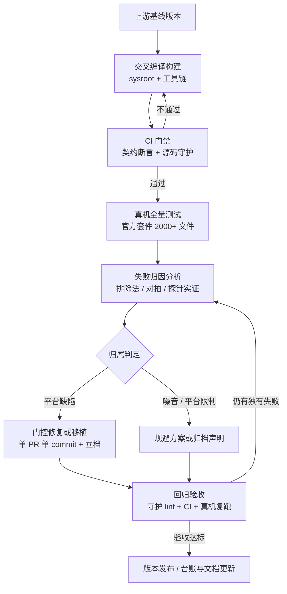
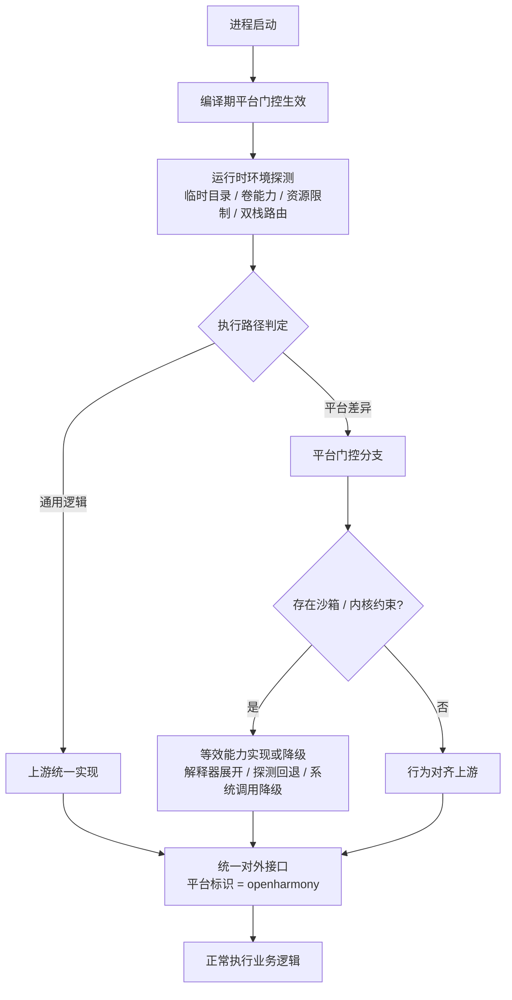

# Bun 鸿蒙化（OpenHarmony 移植）—— 需求设计说明文档

> 适用交付线：Bun v1.4.0 基线 × OpenHarmony aarch64（musl 基，`arm64_ohos`/hmusl），
> 交付分支 `ohos-aarch64`。最新验证构建标识 `14fdf0d56`（2026-09-14）。
> 配套文档：`ohos/issues/`（PR 台账）、`ohos/knowledge/`（长期知识）、
> `ohos/analys/`（失败归因）、`ohos/OpenHarmony-Bun-已知限制与规避指南.md`（对外使用者版）。

---

## 1. Story 概述

### 1.1 背景

Bun 是一体化 JavaScript 运行时与工具链（runtime + 包管理器 + 打包器 + 测试运行器），
主体为 Rust，JS 引擎为 WebKit JavaScriptCore。OpenHarmony 设备侧此前缺少一个
Node.js 兼容、单二进制分发、可直接跑 TypeScript 的现代 JS 运行时；
Bun 官方不支持 OpenHarmony 平台。

### 1.2 Story

**作为**在 OpenHarmony / 鸿蒙设备上进行开发与部署的开发者/集成方，
**我希望** Bun（runtime/包管理器/测试运行器）可以在 OHOS aarch64 设备上构建、运行，
并通过 Bun 官方测试套件的真机全量验证，
**以便**直接使用 `bun run` / `bun install` / `bun test` / `Bun.serve` 等能力，
复用 npm 生态与 Node.js 编程模型。

### 1.3 范围与非目标

| 项 | 内容 |
|---|---|
| 范围 | 交叉编译构建链、运行时平台门控、进程/IO/网络/文件系统适配、包管理适配、CI 流水线、设备全量测试体系 |
| 基线 | 上游 v1.4.0 源码；目标架构 aarch64；libc 为 musl（OHOS 用户态） |
| 验收口径 | CI 全绿（含容器编译）→ 真机 fulltest 验收（文件级通过率 + 独有失败清单比对） |
| 非目标 | HTTP/3(QUIC) 可靠性承诺、glibc 目标、x86/Windows、上游主线合入（另行评估）；EL2 沙箱的平台级硬约束不在 Bun 侧解决（见 §7） |

### 1.4 当前进展（指标快照）

| 指标 | 数值 |
|---|---|
| 真机全量测试规模 | 2001 个测试文件 / 约 6.8 万用例 |
| 文件级通过率 | **90.35%**（1808/2001，2026-09-14 轮） |
| 独有失败演进 | 101 → 39 → **32**（三轮修复），参考实现基线 24 |
| 全量跑时长 | 01:52:46（已优于参考实现 02:00:58） |
| 交付线 PR 台账 | 48 个（#1–#48，全部单 commit、逐 PR 立档） |

---

## 2. 功能点分解

| # | 功能簇 | 内容 | 状态 |
|---|---|---|---|
| F1 | **交叉编译构建链** | OHOS SDK sysroot + llvm@21 交叉编译；harmonybrew core tap 锁 pin + sysroot 契约断言；静态 libunwind；version-script 拆分；链接 shim 符号补全（8→15） | ✅ 容器构建全绿 |
| F2 | **平台标识与门控** | `target_env = "ohos"` 编译期门控；`process.platform`/`os.type()`/`os.platform()` 正确返回 `openharmony`（三层修复）；`OperatingSystem` 枚举补 `OPENHARMONY` | ✅ 源码 lint 守护 |
| F3 | **进程与子进程** | 管道捕获（epoll dup 孤立 fd、memfd→socketpair、close_range、waiter 线程）；`pwritev2/preadv2` ESPIPE 降级；shebang 用户态展开 + CString 悬垂修复；ELF 签名链（spawn 前 codesign、compile strip 重签） | ✅ 主体完成，残留 shell/exec 面见 §7 |
| F4 | **文件 I/O 与 io 模块** | fd-backed `.slice()` 截断修复；`openat2` OHOS 门控；删除 cwd 诚实传播；rlimit 256 跌落回退；tmpdir 运行时探测（AF_UNIX capable）；`is_executable_file` X_OK | ✅ |
| F5 | **网络栈** | uSockets 禁用 `epoll_pwait2`（内核缺陷）；DNS 改 System backend（netsys IPC）+ 无 IPv6 路由时强制 Inet；AF_UNIX 卷探测 | ✅ 主体完成 |
| F6 | **包管理** | lockfile os-mask 迁移（OPENHARMONY bit）；install 平台匹配表；`BUN_NODE_DIR` 落沙箱可写 tmp；原生 `.node/.so` 安装期自动签名；`--backend copyfile` 规避硬链接禁令 | ✅ 主体完成，install 簇仍在收敛 |
| F7 | **测试基础设施** | 官方测试树对账（121 文件改动台账 + 28 处参数适配）；`expectations.txt` 台账；runner/launcher 固化参数；设备 fulltest 工具链（hdc 部署/看门狗/汇总） | ✅ |
| F8 | **CI/CD** | GitHub Actions 容器构建 lane；OHOS canary 浮动验收；PR 门禁脚本（单 commit/内容白名单）；源码 lint 守护（防上游 merge 静默丢失修复） | ✅ |

---

## 3. 实现设计

### 3.1 功能实现思路

移植采取「门控移植」而非「独立分叉」的路线，总体思路概括为五条：

1. **基线对齐、门控收敛**：以上游正式版本为唯一代码基线，全部平台差异以
   编译期平台门控收敛到上游同构位置，不改变整体架构与调用关系——
   保证持续跟进上游版本、可合并、可回溯；
2. **测试数据驱动**：不以「跑通 demo」为目标，而以官方测试套件在真机的
   全量通过率作为唯一量化验收锚点；修什么、先修什么，由失败归因数据决定；
3. **先归因、后动手**：每个异常先通过「排除法 + 参考实现对拍」区分三类归属
   （平台缺陷 / 上游版本窗口差异 / 环境与并发噪音）；内核与沙箱层面难以直接
   观测的行为，先编写独立探针程序实证机制，再确定修复面，杜绝猜测式改动；
4. **约束内实现等效能力**：对平台硬约束（沙箱权限模型、代码签名强制、
   文件系统能力差异）不尝试对抗，而是在平台允许的规则内实现等效能力
   （解释器展开接管、执行方式转换、运行时探测降级等）；无法等效的，
   如实声明为平台限制并给出规避方案；
5. **守护防回退**：关键平台行为以源码级断言测试与 CI 契约检查固定，
   后续任何上游合并或重构若冲掉适配点，验证链立即变红，保证长期可维护。

### 3.2 功能实现设计

按子系统划分设计要点（机制层概括，实现细节见变更台账）：

#### (1) 构建与工具链设计

- **目标**：在标准容器化 CI 环境中一键复现产出目标平台二进制，
  杜绝「本地能编、CI 编不出」与静默错编；
- **设计**：采用「SDK sysroot + LLVM 交叉工具链」方案；工具链与 sysroot 的
  来源、版本全部锁定（pin），构建入口对 sysroot 布局执行契约断言——
  依赖漂移时快速失败并给出自诊断信息；链接侧独立维护平台符号导出表
  与运行库补齐。

#### (2) 平台标识设计

- **目标**：编译期与运行时的平台判定全线一致，应用可用统一范式检测平台；
- **设计**：编译期以目标环境门控；运行时平台标识存在多个来源（原生层
  getter、打包期内联常量、JS 层归一化），设计上要求三层同源同值、统一输出
  `openharmony`，并由源码级断言守护一致性；平台枚举与各处匹配表同步收录新平台。

#### (3) 进程与脚本执行设计

- **目标**：子进程创建、管道数据面、脚本执行语义与其他平台一致；
- **设计**：
  - 管道捕获链按内核行为适配——事件投递异常路径改写并附看门狗兜底，
    内存文件承载不可靠的场景改用可靠原语，fd 清理路径改走内核批量关闭，
    常驻辅助线程在平台上默认启用并预热；
  - 系统调用建立「降级集合」：内核不支持或语义偏差的调用自动回退基础原语
    （如定位读写回退普通读写），并还原错误码语义，避免内核错误码串入
    业务退出码；
  - 针对强制代码签名：运行时在发起脚本执行前做用户态解释器展开
    （脚本降级为参数传入已签名解释器），自身产物与安装期原生模块
    统一接入签名工具链。

#### (4) 文件与 IO 设计

- **目标**：文件读写、切片、目录与路径语义正确；
- **设计**：读循环按平台分支修正截断语义；对依赖运行环境的能力
  （临时目录、本地套接字卷支持、可执行位判定）一律运行时探测而非
  编译期假设；对特殊状态（工作目录被删除、资源限制跌落）采取诚实传播与回退。

#### (5) 网络设计

- **目标**：HTTP / WebSocket / DNS 主链路可用、失败模式可控；
- **设计**：事件栈禁用存在内核缺陷的系统调用；DNS 切换系统解析后端并按
  双栈路由可用性选择地址族；本地 IPC 套接字落点由卷能力探测决定。

#### (6) 包管理设计

- **目标**：安装 / 执行第三方包主链路可用，原生包按平台正确分发；
- **设计**：平台元数据（包协议 os/cpu 字段、锁文件平台位、平台匹配表）全线
  收录新平台；安装物化默认策略适配沙箱（硬链接禁令 → 拷贝式物化）；
  原生二进制在安装期自动签名；缓存与工作目录落点指向可写卷。

#### (7) 平台硬约束的应对设计

| 硬约束 | 应对设计 |
|---|---|
| 硬链接被禁止 | 安装后端推荐拷贝式物化，能力探测失败自动回退 |
| 根目录不可访问 | 以沙箱根为向上查找 / 扫描边界，探测类行为降级 |
| 特权端口不可绑定 | 平台能力边界，依赖使用侧高位端口与降级策略 |
| 未签名脚本不可直接执行 | 用户态解释器展开 + 签名链；运行时产物只产数据、不产可执行映像 |

### 3.3 流程图

**图 1 —— 总体移植与交付流程**：



**图 2 —— 运行时平台适配流程（进程内视角）**：



### 3.4 流程说明

**图 1（总体移植与交付流程）各环节：**

1. **上游基线版本**：锁定上游正式版本作为唯一代码来源，任何适配不脱离基线；
2. **交叉编译构建**：容器内以锁定版本的工具链与 sysroot 交叉编译，
   产出目标平台二进制；
3. **CI 门禁**：构建入口执行依赖布局契约断言与源码守护断言，漂移即红，
   保证问题在构建期暴露；
4. **真机全量测试**：二进制部署到真实设备，运行官方完整测试套件，
   产出全量结果与失败集合清单；
5. **失败归因分析**：对每个失败做参考实现对拍与排除法，先用探针实证
   内核 / 沙箱层面机制；
6. **归属判定与处理**：平台缺陷走门控修复（单 PR、单 commit、同步立档）；
   环境噪音剔除；平台硬限制转为规避方案或明确声明；
7. **回归验收**：修复合入后重过三层验证链（守护 lint → CI → 真机复跑），
   独有失败清单只减不增；
8. **发布与台账更新**：验收达标后产出验证构建，同步更新指标快照与文档。

**图 2（运行时平台适配流程）各环节：**

1. **进程启动**：二进制加载，平台门控在编译期已注入，运行时无二次判别成本；
2. **运行时环境探测**：启动即探测临时目录、文件卷能力（本地套接字支持等）、
   资源限制、网络双栈路由，形成环境画像供后续决策使用；
3. **执行路径判定**：业务代码默认走上游统一实现，仅在门控标注的平台差异点
   进入平台分支——差异面收敛、可枚举、可审计；
4. **约束应对**：平台分支内对沙箱 / 内核约束做等效实现（解释器展开、
   探测回退、系统调用降级）或诚实降级，不向上层暴露异常语义；
5. **统一对外接口**：无论内部走哪条路径，对外统一暴露标准接口与一致的平台
   标识；
6. **正常执行**：业务逻辑在其他平台与本平台之间无感知切换。

---

## 4. 接口描述

### 4.1 接口总体约定

1. **一致性原则**：对外接口与上游保持同一形状——Node.js 兼容模块、Bun 专属
   API、Web 标准 API 三大类均不因平台改变签名与调用方式；平台差异只体现在
   行为层与配置层，不体现在接口层；
2. **统一平台标识**：平台差异的检测入口收敛为一个范式——
   `process.platform === "openharmony"`（配套 `os.type()` / `os.platform()` 同源），
   应用据此做特性开关，其余接口无须感知平台；
3. **兼容性分级**：每个接口面按四级声明——✅ 完全一致（默认）→
   ⚠️ 行为差异（语义一致，性能 / 失败模式不同）→ ⚠️ 受限可用（特定场景
   有问题，提供规避）→ 🚧 平台限制（不可用，附原因与替代方案）。

### 4.2 接口分类描述

| 接口类别 | 覆盖面 | 本平台约定（概括） |
|---|---|---|
| 平台标识类 | `process.platform` / `os.type()` / `os.platform()` / `process.arch` | 返回 `openharmony` 系取值，多来源一致并受守护；其余语义同上游 |
| 进程与脚本类 | `Bun.spawn(Sync)` / `node:child_process` / shebang 脚本执行 | 标准语义；解释器展开与签名校验由运行时内部完成，调用方无感；管道数据面按平台适配 |
| 文件与 IO 类 | `Bun.file` / `Bun.write` / `node:fs` / 路径与目录操作 | 标准语义（含切片截断）；沙箱卷上的硬链接、根目录访问等能力边界以标准错误码如实暴露 |
| 网络类 | `Bun.serve` / `Bun.listen` / `fetch` / `node:net,dns` / WebSocket | 标准语义；特权端口受沙箱限制，DNS 与本地套接字的落点 / 失败模式有平台差异，均可配置规避 |
| 包管理类 | `bun install / add / update / bunx` 与 npm 协议（os/cpu/lockfile） | 标准 npm 语义，平台元数据全线收录新平台；默认安装策略适配沙箱；原生包按平台变体分发，生态覆盖度持续补齐 |
| 运行时工具类 | shell / 测试运行器 / 打包器 / FFI | 主语义同上游；shell 建议配置系统后端；FFI 依赖构建期 sysroot |
| 配置类 | `bunfig.toml` / 环境变量 / CLI flag | 上游配置项全部继续有效；新增少量平台相关配置（脚本执行后端、安装后端、缓存目录、临时目录） |

### 4.3 差异声明与承诺

- 所有行为差异均以「平台检测 + 配置项」形式暴露，不改变接口签名、
  不引入平台专属 API；应用的最小适配成本是几行平台分支代码；
- 沙箱硬约束类差异（硬链接、特权端口、根目录访问、未签名脚本直接执行）
  属于平台能力边界，对任何运行时表现一致，本文档与使用者指南均如实声明
  并给出规避方案；
- 逐项限制、影响场景与规避代码样例统一收口在
  《OpenHarmony-Bun 已知限制与规避指南》，本节不重复展开。

---

## 5. 变更设计

### 5.1 变更区域总表

| 区域 | 主要变更 | 代表交付 |
|---|---|---|
| `src/io/`、spawn 链路 | 管道捕获三机制改写、ESPIPE 降级、waiter 线程 | #32/#34/#41/#39 |
| `src/runtime/webcore/blob/` | fd-backed 读循环 OHOS 分支截断修复 | STATUS 台账 |
| `src/install/`、`src/` 包管理 | BUN_NODE_DIR、安装签名、os 匹配表、lockfile mask | #31/#44/#48 |
| `src/js/`、C++ 绑定 | `process.platform` 三层（getter/bundle 内联/归一化）、shebang 展开 | #29/#30/#17/#22 |
| 网络栈（uSockets、DNS） | `epoll_pwait2` 禁用、DNS System backend + Inet 强制 | #37/#40 |
| 路径/fs 门控 | openat2 门控、cwd/rlimit/tmpdir/X_OK 加固 | #43/#42 |
| 构建脚本 & CI | sysroot 探测链、tap pin + 契约断言、容器 lane、门禁脚本 | #45/#46/#21/#33/#35 |
| `test/` 测试树 | 121 文件对账改动（全部 OHOS-gated，不影响其他平台）+ expectations 台账 | #12 + 台账 |
| lint 守护 | `ohos-sign-call-sites` / `ohos-platform-reporting` 源码 lint | #16/#30 |

### 5.2 变更纪律

- 一个 PR 一个 commit；push 前过 `ohos/check-pr.sh`（单 commit、描述合规、
  diff 白名单、base 含交付线 tip）；
- 每 PR 在 `ohos/issues/` 立档（根因 → 修复 → 验证 → 与参考实现对比），
  P0 阻断构建 / P1 测试回归 / P2 功能不完整 / P3 不阻断；
- 测试树改动全部 OHOS-gated，逐条入 `test-tree-changes-vs-v1-4-0.md` 台账，
  保证对其他平台零影响、对上游可合并。

---

## 6. 测试设计

### 6.1 三层测试体系

| 层 | 载体 | 作用 |
|---|---|---|
| L1 源码守护 | `test/internal/source-lints/ohos-*.test.ts` | 关键平台行为（签名调用点、platform 来源）不被上游 merge 静默冲掉 |
| L2 CI 构建 | GitHub Actions 容器 lane（sysroot 契约断言 + PR 门禁） | 每个交付 PR 可编译、可复现；tap/SDK 漂移即红 |
| L3 真机全量 | `ohos/fulltest/` 工具链（hdc 部署 → launcher → runner → 报告） | 官方套件 2001 文件全量验收，产出 `lists/` 三张集合清单（only / overlap / sys-only） |

### 6.2 真机 fulltest 口径

- 固化参数（跨轮可比，勿改）：`PARALLEL=2`、`RETRIES=2`、
  `BUN_FEATURE_FLAG_INTERNAL_FOR_TESTING=1`、`BUN_GARBAGE_COLLECTOR_LEVEL=0`、
  `GITHUB_ACTIONS=false`、`HOME=$DEVROOT/home`；
- 通过率口径：文件级 = 通过文件/2001；用例级 = `CP / (CP+CF)`，
  超时文件用例剔出分母、崩溃文件保留 partial；
- 对比基准必须同条件：同测试树 commit + 同 node_modules + 同参数 + 同排除规则；
- 独有失败 vs overlap 基线分离统计：overlap 为 OHOS 环境共性（参考实现同样挂），
  独有失败才是本交付线的修复目标。

### 6.3 方法论要点（历史教训固化）

1. **隔离单跑剔除并发假象**：全量并发跑的失败约四成为假象
   （bundler/esbuild 46% 通过率经隔离单跑证伪为 100% 通过）；
2. **统一 `CI=1` 口径**：缺失会使 `todoIf(isCI)` 用例按真用例执行产生假失败；
3. **同基线树锚定**：修复前先与参考构建逐文件/逐字节对拍，避免把上游窗口
   差异误归因为平台缺陷；
4. **探针先行**：内核行为差异（PTY 行规程信号、ESPIPE、epoll 语义）用独立
   C 探针确证后再改代码。

### 6.4 验收链与当前基线

```
L1 lint 绿 → L2 CI 全绿（含容器编译）→ L3 真机 fulltest 验收
（lists/ 三张清单比对：独有失败不新增、预期转绿项达成）
```

三轮演进（同测试树真机）：`c4323a5d3`(101 独有失败) → `0e0fd1559`(39) →
`14fdf0d56`(32)；文件通过率 87.66% → 90.35%；参考实现 90.75% / 24。

---

## 7. 风险与剩余工作

| 项 | 说明 | 计划 |
|---|---|---|
| 6 个回归候选 | wave2 改动（close_range/$PWD/waiter 默认）疑似连带：publish、frozen-lockfile、node-dns、inspect 等 | junit 断言日志排查：回归则修复，环境噪音则归档 |
| cli/install 10 文件簇 | 与参考实现在 `src/install/` 的差异（~14 文件 ~500 行）为唯一未消化大块 | 逐文件对拍 |
| F2 残留 | 目录路由 404（serve-directory-routes 26 用例）；server 代码两树一致，需日志定性 | 探针 + 日志 |
| bun run/exec 输出面 | 参数丢失、`bun exec` 不可用、$ 伪失败（exit 29）已大部分修复，残余见指南 1.1–1.3 | 随管道链路收尾 |
| 生态缺口 | npm 无 openharmony prebuilds（sharp/canvas/resvg/rspack/lightningcss）；`@ohos-ports` 过渡包已验证可用 | 跟进上游合并与生态补齐 |
| 平台限制（不可修） | PTY Ctrl-Z/SIGWINCH 行规程、inotify@hmdfs、DNS NXDOMAIN 2s 超时、bunx hmdfs uid | 使用侧规避（见指南） |

### 下一步（按收益排序）

1. junit round C：用例级数据从推断转精确，剩余 32 独有失败逐用例归位；
2. 回归候选清零（不解决则逐轮缩小会停滞）；
3. `src/install/` 差异对拍收口 cli/install 簇；
4. F2 目录路由日志定性。

---

*维护：随每轮 fulltest 复跑与 PR 合并更新 §1.4 / §6.4 / §7；数据来源
`ohos/analys/20260914-round-report.md` 与 `ohos/issues/README.md` 台账。*
